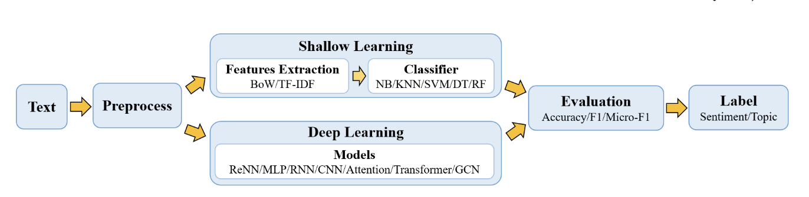
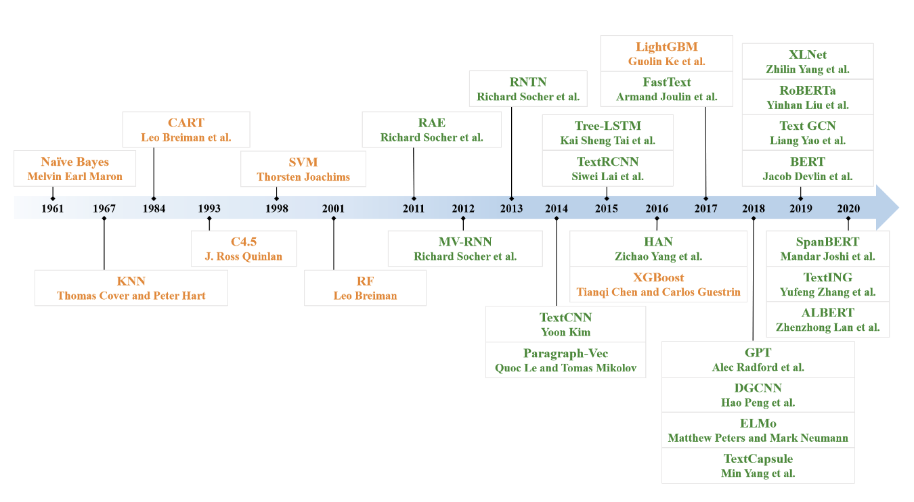
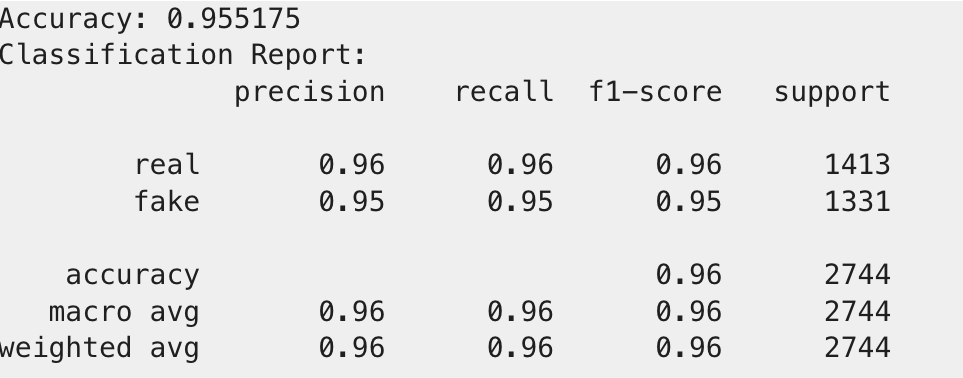
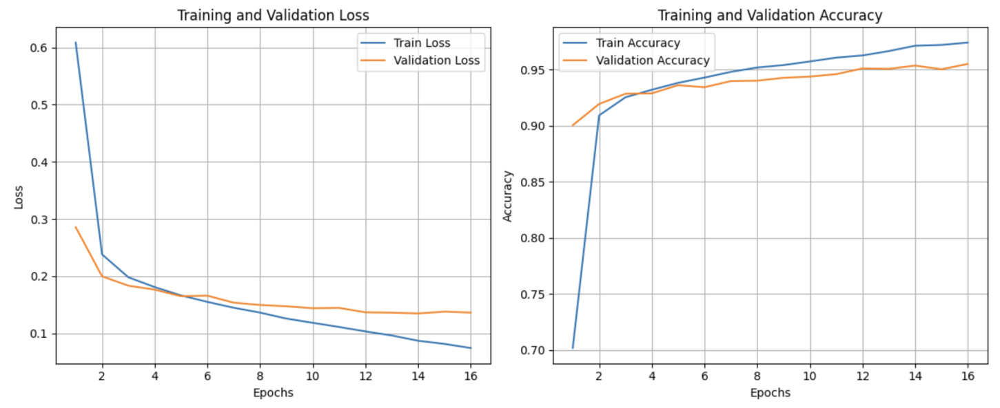
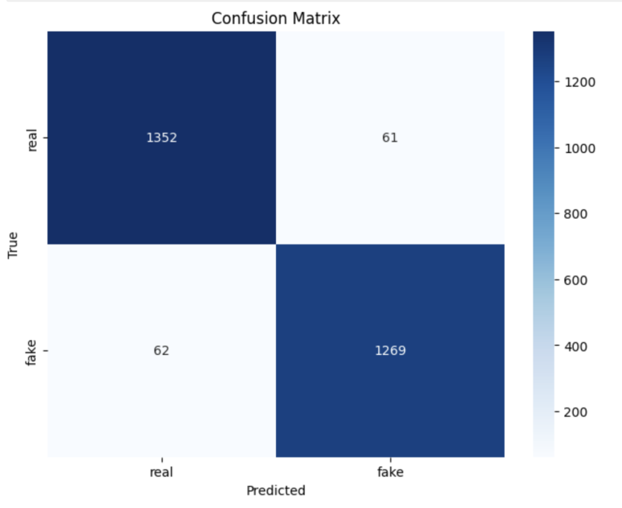
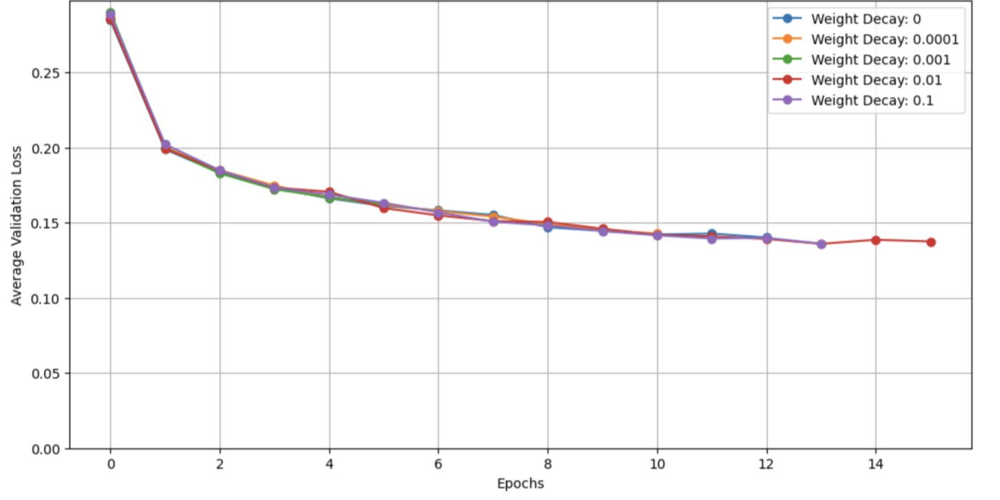
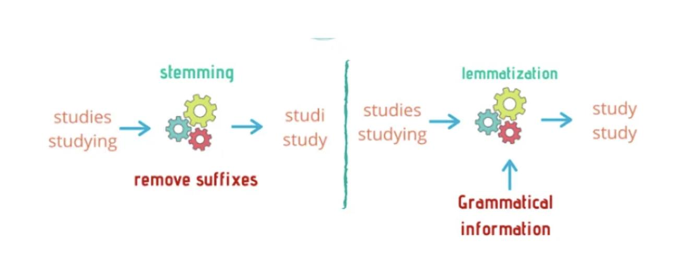

# Training a COVID-19 Fake News Detector

Data ScienceTech Institute, 2024

Contributors: Costa L., Romeo L., Len N., Herbet A.
Project contact: [Nicolas Len](https://www.linkedin.com/in/niclen/)

## Introduction
As discussed in early 2024 by WHO contributors, the COVID-19 crisis involved not only an epidemic but also an "infodemic" of misleading information [1](#ref-1). Misinformation can alter protective behavior and worsen public-health outcomes. In the UK, online misinformation about mask wearing was associated with an estimated 21,947 additional COVID-19 cases, 2,187 hospitalizations, and 509 deaths between April 1 and November 10, 2020 [2](#ref-2). In the US survey by Neely et al., vaccination rates decreased from 73.8% among respondents with no reported exposure to vaccine misinformation to 52.2% among respondents exposed to six or more misinformation themes [3](#ref-3). These findings motivated us to frame this work as a binary text-classification problem and train an NLP-based detector.

### Objective
The objective of this project is to build an effective deep learning model for detecting COVID-19-related fake news. Our goal is to classify text as either real or fake with high accuracy, thereby supporting efforts to reduce the societal harm caused by misinformation.

### Context
The COVID-19 pandemic created a global health emergency that was amplified by rapid online dissemination of misinformation and disinformation. False medical advice and conspiracy narratives contributed to confusion, reduced trust, and, in some cases, harmful behavior. Manual fact-checking remains valuable but is resource intensive and difficult to scale in real time. For this reason, automated text-based detection systems are increasingly needed.

Deep learning is well suited to this task because it can learn semantic and contextual patterns directly from large corpora. Modern language models provide a practical foundation for scalable fake news classification.

### Problem Statement
We address the task of classifying individual COVID-19-related textual items as real or fake. The central challenge is to learn linguistic and contextual cues that distinguish misinformation while maintaining strong performance on unseen examples. A robust model can support broader misinformation-mitigation workflows.

## Literature Review
Li et al. [4](#ref-4) reviewed the evolution of text classification from shallow to deep learning methods. In that context, shallow models include both neural networks with limited depth and traditional machine-learning approaches such as K-nearest neighbors, support vector machines, and random forests. Figure 1 illustrates a classical text-classification pipeline.

Figure 1. Classical and deep learning text-classification pipeline.

Figure 2 highlights the emergence of deep learning architectures for text tasks, including RAE, LSTM, and TextRCNN, followed by transformer-based approaches after the introduction of attention mechanisms in 2017 [5](#ref-5). Since then, models such as ELMo, GPT, and BERT have substantially shifted NLP practice. Although BERT was not originally designed only for text classification, BERT-based models became widely used because of strong empirical performance on classification benchmarks.

Figure 2. Historical timeline of major text-classification methods (1961-2020).

A second key topic is dataset selection. We cannot train or fine-tune supervised models without labeled data. To choose appropriate datasets, we first need to define the task precisely. In our case, we classify COVID-19-related textual claims as fake or real.

Gasparetto et al. [6](#ref-6) describe multiple text-classification tasks:

- Sentiment analysis (SA): identifying affective or subjective content in text.
- Topic labeling (TL): identifying one or more themes in a text.
- News classification (NC): assigning categories to news items.
- Question answering (QA): selecting an answer from candidate spans or sentences.
- Natural language inference (NLI): determining entailment relations between sentences.
- Named entity recognition (NER): locating and classifying entities in unstructured text.
- Syntactic parsing (SP): predicting morpho-syntactic properties such as part-of-speech tags and dependencies.

Our task corresponds to news classification (NC).

Another important topic is evaluation. Lu [7](#ref-7) and Padalko [8](#ref-8) use standard classification metrics for fake news detection:

- Confusion matrix (true positives, false positives, true negatives, false negatives).
- Derived metrics including accuracy, precision, recall, F1-score, ROC curve, and AUC.

Task-specific generation metrics such as BLEU, ROUGE, METEOR, or perplexity are not central here because our output is a class label rather than generated text.

Xi and Zhang [9](#ref-9) reported a COVID-19 fake news detector based on an attention-based transformer, with 75.9% accuracy and AUC = 0.774.

## Experiments
### Datasets
This project used two COVID-19-related datasets.

- COVID-19-FNIR dataset: the COVID-19 Fake News Infodemic Research dataset includes 7,588 items, with approximately balanced labels (49.99% real, 50.01% fake) [citation needed]. We retained only `Text` and `Label` for modeling.
- COVID-19 Fake News Detection dataset: this corpus contains 10,700 social-media items labeled as real or fake, with a near-balanced class split (52.34% real, 47.66% fake) [citation needed].

For this project, we merged both datasets into a unified corpus. We standardized column names and labels (`fake` -> 0, `real` -> 1). The resulting dataset contains 18,288 items, with 51% real and 49% fake. We then split the corpus into training/validation/test subsets for comparative analysis.

### Methodology
We first trained classical baselines using TF-IDF features with a support vector machine and a random forest. Without extensive hyperparameter optimization, we obtained:

- SVM: accuracy = 0.907, F1-score = 0.900.
- Random forest: accuracy = 0.905, F1-score = 0.900.

These baselines provided a reference point for subsequent deep learning experiments.

Many studies follow a pipeline similar to Xia et al. [10](#ref-10), with preprocessing conventions discussed in sources such as [11](#ref-11):

- Prepare the data (splits, exploratory analysis).
- Preprocess and encode text.
- Fine-tune a model.
- Evaluate performance.
- Analyze metrics.

Because this was a deep learning project, we prioritized the last three stages.

We implemented a full text-classification workflow. Our initial RoBERTa-based setup achieved 0.882 accuracy. We then compared multiple embedding backbones and obtained the best result with Stella embeddings [12](#ref-12), reaching 0.945 accuracy.

After selecting the embedding approach, we tuned our `simpleNN` architecture:

- Hidden layers: we moved from two hidden layers to three hidden layers plus one output layer.
- Hidden dimensions: we compared alternative width schedules and observed better performance with `(1536, 3072, 3072, 768, 2)` than with `(1536, 3072, 1536, 768, 2)`.
- Activation: ReLU performed better than GELU, ReLU6, and SiLU in our runs.
- Output mapping: replacing the output setup with a sigmoid-based configuration did not improve results.
- Dropout: the best value was close to 0.6.
- Optimization: we used AdamW and tuned learning rate and weight decay (L2 regularization).

In training, we also used:

- Cross-validation to improve robustness.
- Early stopping with patience.
- Weight decay for regularization.

We selected hyperparameters on training/validation folds, then trained and evaluated the final configuration on held-out test data.

Primary monitoring metrics were:

- Training and validation loss curves (for overfitting diagnostics).
- Validation accuracy.
- F1-score.
- ROC curve and AUC (area under the curve).

## Results
### Our Results
We trained a final model with strong performance, summarized in Figure 3.

Figure 3. Final model classification report and overall accuracy.

- Accuracy: 95.5175%.
- F1-score: 95% for the fake class and 96% for the real class.
- AUC: 0.955124.

The loss curves in Figure 4 suggest limited overfitting.

Figure 4. Training and validation loss and accuracy curves.

From the confusion matrix in Figure 5, we computed additional metrics:

Figure 5. Confusion matrix of final test predictions.

- Precision = 1352 / (1352 + 62) = 0.95615.
- Recall (sensitivity) = 1352 / (1352 + 61) = 0.95683.
- Specificity = 1269 / (1269 + 61) = 0.95414.

We also report one cross-validation result used to tune L2 regularization (weight decay in AdamW), shown in Figure 6.

Figure 6. Cross-validation loss across AdamW weight-decay values.

Finally, the ROC curve in Figure 7 indicates stable class discrimination.

Figure 7. ROC curve of the final model (AUC shown in legend).

### Discussion
A major limitation of our work is preprocessing depth. We intentionally focused on the deep learning component, but preprocessing choices can still materially affect performance. We also assumed that transformer-based models are less sensitive to some preprocessing operations than shallow models; however, this assumption is task dependent.

As discussed in [13](#ref-13), stemming, lemmatization, and stop-word handling can improve or degrade performance depending on context and objective.

Figure 8. Conceptual comparison of stemming and lemmatization.

- Stemming removes affixes to reduce tokens to coarse roots.
- Lemmatization maps words to canonical dictionary forms.
- Stop-word removal drops frequent functional words (for example, "the" or "an"), which can reduce noise but may also remove useful context.
- Punctuation removal reduces token fragmentation but may discard semantic cues.
- Lowercasing improves consistency but may remove case-specific signal.

We also considered generalization risk. Although performance on our test split is strong, real-world deployment may face distribution drift in both language and misinformation patterns.

Our architecture is intentionally simple. More advanced hybrid structures (for example, CNN-RNN-transformer combinations such as in [10](#ref-10)) may improve robustness but require additional design and tuning effort. We also considered exploring multi-head attention variants [14](#ref-14) and broader regularization strategies, including explicit L1 and Elastic Net objectives [15](#ref-15).

In ablation-style trials, sigmoid-based output settings and binary cross-entropy did not outperform our final cross-entropy configuration.

## Conclusion
This project improved our understanding of deep learning and NLP for text classification. It also highlighted the practical difficulty of collaborative model development under time constraints.

We achieved performance that is higher than the values reported by Xi and Zhang [9](#ref-9) for their 2021 setting, while noting that direct cross-study comparisons should be interpreted carefully when datasets and protocols differ.

Operationally, we also encountered infrastructure instability in Google Colab, where `flash-attn` compatibility changed across GPU configurations. Final experiments were run on an A100 setup after T4-based runs became unreliable.

Consistent with [16](#ref-16), model selection remains use-case dependent: shallow and deep approaches can both be appropriate depending on constraints, available data, and deployment objectives.

## References

- [1] Abed S., Allain-Ioos S., Shindo N. Understanding disinformation in the context of public health emergencies: the case of COVID-19. Weekly Epidemiological Record, no. 4, January 26, 2024.

- [2] London Economics. The Cost of Lies: Assessing the Human and Financial Impact of COVID-19 Related Online Misinformation on the UK. December 2020.

- [3] Neely S.R. et al. Vaccine hesitancy and exposure to misinformation: a survey analysis. Journal of General Internal Medicine. 2022;37(1):179-187.

- [4] Li Q., Peng H. et al. A survey on text classification: from shallow to deep learning. arXiv:2008.00364 (2020). [Source](https://arxiv.org/abs/2008.00364)

- [5] Vaswani A. et al. Attention Is All You Need. arXiv:1706.03762 (2017). [Source](https://arxiv.org/abs/1706.03762)

- [6] Gasparetto A., Marcuzzo M., Zangari A., Albarelli A. A Survey on Text Classification Algorithms: From Text to Predictions. Information. 2022;13(2):83. [Source](https://doi.org/10.3390/info13020083)

- [7] Lu H. Deep Learning for Fake News Detection: Theories and Models. EITCE 2022. [Source](https://doi.org/10.1145/3573428.3573663)

- [8] Padalko H. et al. Misinformation Detection in Political News using BERT Model. ProfIT AI 2023 (Waterloo, Canada).

- [9] Xi J., Zhang C. COVID-19 fake news detection using attention-based transformer. ICMLCA 2021.

- [10] Xia H. et al. COVID-19 fake news detection: a hybrid CNN-BiLSTM-AM model. Technological Forecasting and Social Change, 195 (2023). [Source](https://doi.org/10.1016/j.techfore.2023.122746)

- [11] IBM. Stemming vs. Lemmatization. [Source](https://www.ibm.com/topics/stemming-lemmatization)

- [12] Hugging Face model card: dunzhang/stella_en_1.5B_v5. [Source](https://huggingface.co/dunzhang/stella_en_1.5B_v5)

- [13] Aydin A. Stemming and Lemmatization in NLP. [Source](https://ayselaydin.medium.com/2-stemming-lemmatization-in-nlp-text-preprocessing-techniques-adfe4d84ceee)

- [14] Wang D.K. Multihead Attention from Scratch. [Source](https://medium.com/@wangdk93/multihead-attention-from-scratch-6fd6f99b9651)

- [15] Versloot C. How to use L1, L2 and Elastic Net regularization with PyTorch. [Source](https://github.com/christianversloot/machine-learning-articles/blob/main/how-to-use-l1-l2-and-elastic-net-regularization-with-pytorch.md)

- [16] Zhukov V. Choosing the best architecture for your text classification task. [Source](https://medium.com/toloka/choosing-the-best-architecture-for-your-text-classification-task-aee30ecc7870)

---

## Contact

Nicolas Len  
👤 [LinkedIn](https://www.linkedin.com/in/niclen/)
💻 Code repository: [covid19-fake-news-detector](https://github.com/nicolas-len/covid19-fake-news-detector)

